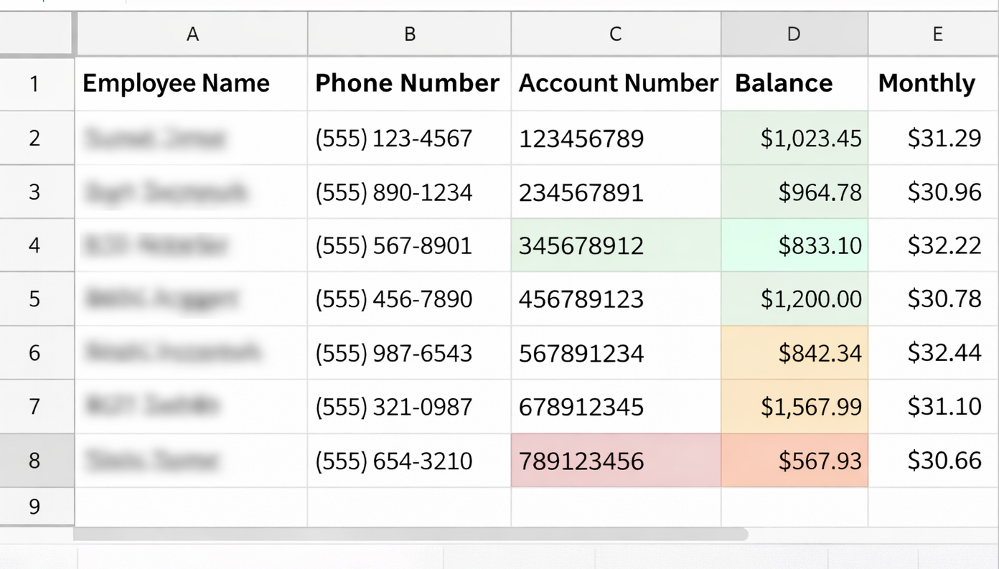

# Excel Account Sync Automation

This Python script automates reconciliation between a master spreadsheet and monthly ingest sheets.

Master Sheet:
PhoneMasterSpreadSheet

Monthly Sheets:
UCJan
UCFeb
UCMar
etc.

The script automatically detects the current month and ingests the correct sheet.

Features
- Preserves master sheet structure
- Updates balances only
- Flags unmatched accounts
- Color codes updates
- Detects invalid account numbers
- Creates audit logs
- Automatic monthly sheet detection
- Detects potential costly abnormalities

Example workflow

1. Monthly sheet UCMar is added
2. Script detects UCMar automatically
3. Updates balances in PhoneMasterSpreadSheet
4. Logs all changes

Tech Stack
Python  
openpyxl

## Example Output

## Setup
pip install -r requirements.txt

## Run
python sync_accounts.py --file "your_workbook.xlsx"

